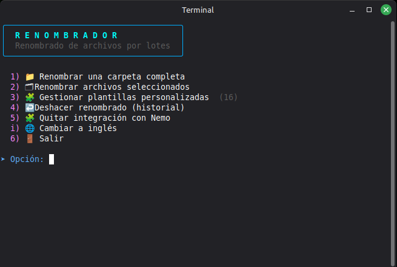
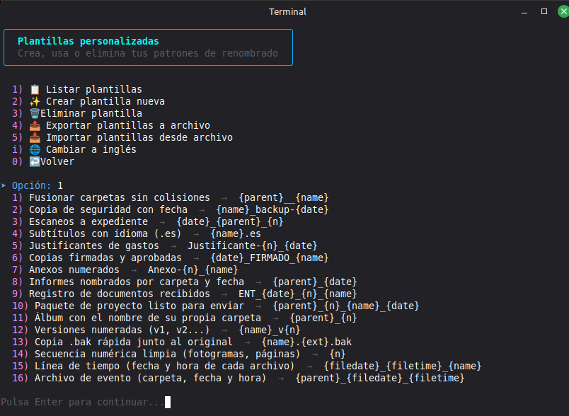
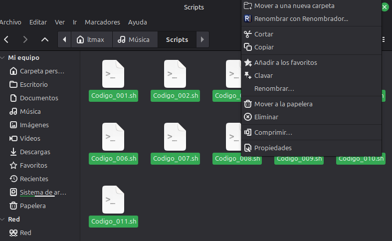

# Renombrador

Renombra archivos y carpetas por lotes desde un menú en la terminal o con clic derecho en Nemo, con vista previa antes de aplicar nada y la opción de deshacerlo después.

**Idioma:** [English](README.md) · Español


**Demostración:** [ver el video](assets/screenshots/demo-es.mp4) — renombrar una carpeta con una plantilla lista para usar: vista previa, aplicar y deshacer.

https://github.com/user-attachments/assets/89409261-b79a-45c9-bd15-eafa546f975a

> **Actualización 1.1.0**
>
> - **[Español e inglés](#idioma-y-roadmap).** Menús, ayuda y mensajes en ambos idiomas; se cambia con `i` (queda guardado), `--lang` o `RENOMBRADOR_LANG`. El README también está en los dos.
> - **[Nemo](#instalación).** La acción de clic derecho se puede activar o desactivar sin desinstalarla (`--activar-nemo`, `--desactivar-nemo` o la opción 5 del menú), y el icono ahora va incrustado en el script.
> - **[Plantillas](#plantillas-listas-para-usar).** Nuevos comodines `{filedate}` y `{filetime}` y 16 plantillas listas para importar.
> - **[Aplicar y deshacer, más seguros](#deshacer-y-por-qué-es-seguro).** Deshacer solo revierte lo que no ha cambiado desde el lote, las copias se publican atómicamente, `Ctrl+C` ya no deja un lote a medias, y la configuración, las plantillas y el historial se escriben atómicamente.
> - **Además.** Fechas EXIF más rápidas en carpetas grandes, los nombres largos conservan su extensión, se rechazan los valores no válidos de `--inicio`/`--digitos`, ahora hacen falta Bash 4.1+ y `flock`, y una batería de pruebas de regresión con ShellCheck se ejecuta en CI.
>
> **Al actualizar desde la 1.0.0:** los lotes guardados con ella siguen en el historial, pero ya no se pueden deshacer. Las plantillas guardadas se conservan. Si se usa la integración con Nemo, hay que volver a ejecutar `./renombrador.sh --instalar-nemo` para actualizar la copia instalada.

---

Es un único script de Bash. En ejecución necesita Bash 4.1+ y las utilidades habituales de GNU/Linux para manejar archivos (incluido `flock`); `zenity` o `kdialog` solo hacen falta para los selectores gráficos. Está pensado para el uso de cada día: renombrar 40 fotos, 200 facturas o una carpeta de descargas con nombres inconsistentes, sin hacerlo archivo por archivo ni arriesgarse a que dos acaben con el mismo nombre.

**Índice:** [Compatibilidad](#compatibilidad) · [Instalación](#instalación) · [Guía rápida](#guía-rápida-renombrar-una-carpeta-de-fotos) · [Métodos disponibles](#métodos-de-renombrado-disponibles) · [Deshacer](#deshacer-y-por-qué-es-seguro) · [Línea de comandos](#modo-línea-de-comandos) · [Scriptya](#instalar-y-lanzar-renombrador-con-scriptya) · [Idioma y roadmap](#idioma-y-roadmap) · [Pruebas](#pruebas) · [Contribuir](#contribuir)





## Compatibilidad

Desarrollado y probado en **Linux Mint 22.3 Cinnamon**. El motor de renombrado en sí no depende de Cinnamon para nada: necesita Bash 4.1 o superior (por las redirecciones `{fd}`) y las utilidades de archivos de GNU/Linux habituales (entre ellas `mv`, `find`, `stat`, `realpath`, `tar`, `sed` y `mktemp` de GNU, y `flock` de util-linux). `zenity` o `kdialog` solo hacen falta para los selectores gráficos, así que funciona igual en cualquier distro con Bash 4.1 o superior. Entre las más conocidas:

- **Basadas en Ubuntu/Debian**: Ubuntu, Debian, Linux Mint, Pop!_OS, elementary OS, Zorin OS, MX Linux...
- **Basadas en Fedora**: Fedora, Nobara...
- **Basadas en Arch**: Arch Linux, Manjaro, EndeavourOS...
- **openSUSE**: Leap y Tumbleweed

Si no hay `zenity` instalado, el propio script detecta cuál de estos gestores de paquetes usa el sistema (`apt`, `dnf`, `pacman` o `zypper`) y se ofrece a instalarlo automáticamente.

La integración de clic derecho es específica del gestor de archivos **Nemo** (el de Cinnamon), presente en Linux Mint y en cualquier distro que use el escritorio Cinnamon. Con el resto de escritorios (GNOME, KDE Plasma, Xfce, MATE...) el script funciona exactamente igual desde la terminal; simplemente no hay entrada en el menú contextual del gestor de archivos.

También se adapta a terminales más limitadas: en una consola virtual sin entorno gráfico o una sesión SSH sin locale UTF-8, los emoji y símbolos de los menús caen automáticamente a texto plano en vez de mostrarse como caracteres rotos.

## Instalación

```bash
git clone https://github.com/filonux/Renombrador.git
cd Renombrador/script
chmod +x renombrador.sh
./renombrador.sh
```

Eso abre el menú principal directamente, sin instalar nada en el sistema. Por ahora esta es la única vía de instalación — no hay paquete `.deb` todavía (ver el mini roadmap más abajo). Para tenerlo también en el clic derecho de Nemo:

```bash
./renombrador.sh --instalar-nemo
```

Esto copia el script a `~/.local/share/renombrador/` y añade la acción «Renombrar con Renombrador...» al menú contextual de Nemo. El icono va incrustado en el propio script (un PNG de 64×64), así que no hace falta nada más del repositorio: se instala en tu tema de iconos de usuario (`~/.local/share/icons/hicolor/64x64/apps/renombrador.png`) y la acción lo referencia por nombre, algo que admiten todas las versiones de Nemo. La acción se escribe en el idioma actual del programa (que queda guardado) y sigue sus cambios de idioma. Para quitarla: `./renombrador.sh --desinstalar-nemo`. Esto borra la acción de Nemo y ese icono; la copia del script en `~/.local/share/renombrador/`, y tus plantillas e historial en `~/.config/renombrador/`, se quedan donde están, así que si no quieres ningún rastro hay que borrar esas carpetas a mano. El menú principal también puede hacerlo: la opción 5 cambia sola su texto entre «Integrar con Nemo (clic derecho)» y «Quitar integración con Nemo» según el estado actual. Una vez instalada, abre un submenú para activar/desactivar la integración sin desinstalarla, o para quitarla (pide confirmación) — el mismo interruptor está disponible desde la terminal con `--activar-nemo`/`--desactivar-nemo`.

Dependencia opcional: `exiftool` (paquete `libimage-exiftool-perl`) o `identify` de ImageMagick, para leer la fecha real de captura de una foto. Sin ninguna de las dos, las opciones que dependen de esa fecha caen automáticamente en la fecha de modificación del archivo.

## Guía rápida: renombrar una carpeta de fotos

Un ejemplo completo, de principio a fin. Supongamos que hay una carpeta `~/Imágenes/Vacaciones` llena de fotos (unas 300) con nombres como `IMG_2031.jpg`, `IMG_2032.jpg`... y se quieren dejar como `Vacaciones_001.jpg`, `Vacaciones_002.jpg`..., numeradas por el orden real en que se tomaron.

1. Se abre una terminal y se ejecuta el script:

   ```bash
   ./renombrador.sh
   ```

   Aparece el menú principal.

2. Se elige `1` (**Renombrar una carpeta completa**). Se abre el selector de carpetas: se navega hasta `Vacaciones` y se acepta.

3. El script hace algunas preguntas de sí/no por teclado (subcarpetas, ocultos, filtro por extensión...). Para este caso basta con pulsar **Enter** en todas y dejar los valores por defecto.

4. Aparece el menú de métodos. Se elige `1` (**Numeración secuencial**).

5. Pregunta:
   - **Texto base**: se escribe `Vacaciones`
   - **Orden**: se elige `3` (fecha EXIF real de la foto), para que `001` sea la primera foto tomada de verdad y no la primera por orden alfabético
   - **Número inicial** y **dígitos de relleno**: Enter en ambos. Empieza en 1 y el relleno se ajusta al total de archivos: con 100 a 999 fotos sale `001`, con 10 a 99 sale `01` y con menos de 10 sale `1`

6. Aparece una vista previa: `IMG_2031.jpg → Vacaciones_001.jpg`, y así con cada archivo. Si se quiere añadir otra transformación encima (por ejemplo, pasar todo a minúsculas), se elige otro método del menú; si ya está como se quiere, se escribe `a` (**Aplicar todos los cambios**).

7. Pregunta si **mover** (renombra los archivos de verdad) o **copiar** (deja los originales intactos y crea copias con el nombre nuevo). Para una primera prueba, copiar es la opción más tranquila.

8. Se confirma con `s` y listo — las fotos ya tienen su nombre nuevo. `y` también se acepta, por compatibilidad con la entrada en inglés.

Escrito paso a paso parece largo, pero la mitad de esos pasos son solo pulsar Enter para aceptar los valores por defecto: en la práctica son un par de minutos de teclado para ordenar toda la carpeta, en vez de renombrar las fotos una por una a mano.

¿Algo salió mal? Se vuelve al menú principal, opción `4` (**Deshacer renombrado**), y Enter para elegir el lote más reciente (`0` cancela). No hay una segunda confirmación: elegir un lote lo deshace al momento. Los elementos que hayan cambiado desde su aplicación se dejan intactos y siguen en el historial, por si se quiere reintentar más tarde.

Para no tocar la terminal en el día a día: se instala la integración con Nemo una vez (`./renombrador.sh --instalar-nemo`) y luego, desde el gestor de archivos, se seleccionan los archivos y clic derecho → **«Renombrar con Renombrador...»**. Se abre una terminal con esos archivos ya cargados, directa en el paso 4 de arriba.

## Métodos de renombrado disponibles

Desde el menú de métodos se puede aplicar uno o varios de estos, en cualquier orden y encadenados entre sí, con vista previa acumulada en todo momento y la opción de deshacer el último paso si algo no cuadra, antes de confirmar nada:

| Método | Qué hace |
| --- | --- |
| Numeración secuencial | Texto fijo + número, o el nombre original + número. Empieza en 1 y el relleno por defecto depende del total de archivos: 9 dan `Vacaciones_1`, 10 dan `Vacaciones_01` y 100 dan `Vacaciones_001`. Se puede ordenar por orden actual, fecha de modificación, fecha EXIF real o tamaño. |
| Añadir prefijo | Antepone un texto a cada nombre. |
| Añadir sufijo | Añade un texto justo antes de la extensión. |
| Buscar y reemplazar | Texto literal o expresión regular (ERE), con grupos de captura `\1`, `\2`... en el reemplazo. |
| MAYÚSCULAS/minúsculas | minúsculas, MAYÚSCULAS, Capitalizar Cada Palabra, o solo la primera letra de la frase. Las dos primeras cambian también la extensión (`Foto.jpg` → `FOTO.JPG`); las otras dos la dejan como está. |
| Insertar fecha | Fecha actual, fecha de modificación o fecha EXIF real, al principio o al final del nombre. |
| Limpiar nombre | Sustituye los espacios por guion bajo o guion, o los elimina, y quita `< > : " \ \| ? *` del nombre (la extensión no se toca). |
| Plantilla automática por tipo | Sustituye todo el nombre por el tipo y un contador propio de cada tipo, siempre de 3 dígitos (`Foto_001.jpg`, `Foto_002.jpg`, `Video_001.mp4`...). Según la extensión, los tipos son `Foto`, `Video`, `Audio`, `Documento`, `Comprimido`, `Codigo` y `Archivo` (todo lo demás). Las etiquetas son siempre estas, en español y en inglés, así que cambiar de idioma no cambia los nombres. |
| Plantilla personalizada | Aplica una plantilla ya guardada, con comodines. Se gestionan (crear, listar, eliminar, exportar, importar) desde la opción 3 del menú principal. |
| Patrón puntual | Igual que una plantilla, pero sin guardarla para más adelante. |

Las plantillas y el patrón puntual usan estos comodines:

| Comodín | Se sustituye por |
| --- | --- |
| `{name}` | Nombre original, sin extensión |
| `{ext}` | Extensión original, sin el punto |
| `{n}` | Número de secuencia (pregunta por dónde empieza y cuántos dígitos de relleno; por defecto, desde 1 y sin relleno) |
| `{date}` | Fecha de hoy, en formato `AAAA-MM-DD` |
| `{parent}` | Nombre de la carpeta que contiene el archivo |
| `{filedate}` | Fecha del propio archivo, en formato `AAAA-MM-DD`: la fecha EXIF de captura en las fotos y la fecha de modificación en todo lo demás |
| `{filetime}` | Hora del propio archivo, en formato `HH-MM-SS`, con el mismo origen que `{filedate}` |

Si la plantilla no incluye `{ext}`, la extensión original se añade sola al final. Ejemplo: `{date}_{name}_{n}` sobre `factura.pdf` → `2026-08-04_factura_1.pdf`.

### Plantillas listas para usar

[`assets/templates/`](assets/templates/) incluye 16 plantillas listas para importar: `plantillas-ejemplo.es.conf` (nombres en español) y `example-templates.en.conf` (nombres en inglés) contienen los mismos 16 patrones. En el menú principal se elige `3` (**Gestionar plantillas personalizadas**), luego `5` (**Importar plantillas desde archivo**) y se selecciona el archivo. Los nombres que ya existen se omiten, así que importar dos veces no hace daño.

Con el almacén vacío, **Usar plantilla personalizada guardada** ofrece cargar plantillas desde un archivo y pasa a la lista; el selector se abre en `assets/templates/` si existe junto al script. Solo admite texto de hasta 1 MiB y limpia BOM y CRLF.

| N.º | Plantilla | Patrón |
| --- | --- | --- |
| 1 | Fusionar carpetas sin colisiones | `{parent}__{name}` |
| 2 | Copia de seguridad con fecha | `{name}_backup-{date}` |
| 3 | Escaneos a expediente | `{date}_{parent}_{n}` |
| 4 | Subtítulos con idioma (.es) | `{name}.es` |
| 5 | Justificantes de gastos | `Justificante-{n}_{date}` |
| 6 | Copias firmadas y aprobadas | `{date}_FIRMADO_{name}` |
| 7 | Anexos numerados | `Anexo-{n}_{name}` |
| 8 | Informes nombrados por carpeta y fecha | `{parent}_{date}` |
| 9 | Registro de documentos recibidos | `ENT_{date}_{n}_{name}` |
| 10 | Paquete de proyecto listo para enviar | `{parent}_{n}_{name}_{date}` |
| 11 | Álbum con el nombre de su propia carpeta | `{parent}_{n}` |
| 12 | Versiones numeradas (v1, v2...) | `{name}_v{n}` |
| 13 | Copia .bak rápida junto al original | `{name}.{ext}.bak` |
| 14 | Secuencia numérica limpia (fotogramas, páginas) | `{n}` |
| 15 | Línea de tiempo (fecha y hora de cada archivo) | `{filedate}_{filetime}_{name}` |
| 16 | Archivo de evento (carpeta, fecha y hora) | `{parent}_{filedate}_{filetime}` |

Las dos últimas construyen el nombre con la fecha y la hora propias de cada archivo. El método integrado **Insertar fecha** solo añade la fecha, así que estas son la forma de meter la hora del día en un nombre. La marca de tiempo va al principio, de modo que ordenar por nombre es ordenar por tiempo, aunque los archivos vengan de móviles y cámaras distintos. **Archivo de evento** descarta el nombre original; **Línea de tiempo** lo conserva. Dos archivos con el mismo segundo nunca se pisan: el segundo recibe `(1)`.

## Deshacer y por qué es seguro

Cada lote aplicado queda guardado en un historial: la opción `4` del menú principal deja repasar los últimos 20 lotes y deshacer el que se quiera, no solo el más reciente; elegir un lote lo deshace al momento. Los historiales escritos por versiones antiguas sin verificación de estado se conservan, pero no se deshacen automáticamente.

Deshacer un lote aplicado en modo copiar no «restaura» nada (los originales nunca se tocaron): solo borra las copias cuyo estado siga coincidiendo con el del lote. Un lote en modo mover devuelve a su nombre original cada elemento que no haya cambiado; los que hayan cambiado se dejan intactos.

Por debajo, en modo **mover** tanto al aplicar como al deshacer los cambios se hacen en dos fases: primero se mueve todo a nombres temporales únicos y solo después a los nombres finales. Así, un lote donde el archivo A pasa a llamarse B y B pasa a llamarse A a la vez se resuelve bien, en lugar de que uno se sobrescriba al otro — algo con lo que un simple `mv` en bucle no sabe lidiar. El modo **copiar** no tiene esas fases: cada elemento se copia a una carpeta de preparación oculta junto al original y se publica con su nombre final de una sola vez, de modo que una copia interrumpida nunca deja un archivo a medias, y deshacer un lote de copias las elimina una a una. Los ficheros de configuración, plantillas e historial se escriben primero en un temporal del mismo directorio, se sincronizan antes de publicarlos y después se sustituyen atómicamente con `mv -T`, de modo que nunca se observa un fichero escrito a medias. Además, los nuevos lotes guardan una huella de cada elemento (su contenido completo, o tamaño y fecha de modificación si supera los 8 MiB) para detectar cambios posteriores antes de tocar los datos actuales.

Si se interrumpe con `Ctrl+C` (o llega SIGTERM o SIGHUP, por ejemplo al cerrar la terminal) mientras se aplica o se deshace un lote, el script no corta a medias: en modo mover completa las dos fases y actualiza el historial antes de salir; en modo copiar se detiene al terminar el elemento en curso. Las copias ya hechas quedan en el historial, y al deshacer, lo que no llegó a procesarse sigue en él para reintentarlo. Sale con un aviso y con el código 130 (`Ctrl+C`), 143 (SIGTERM) o 129 (SIGHUP). Fuera de ese tramo, `Ctrl+C` termina el script al instante: en un menú o una pregunta todavía no se ha tocado nada.

Si el proceso muere sin poder limpiar (un corte de luz, `kill -9`), pueden quedar elementos ocultos `.renombrador_*` en las carpetas. Al empezar a aplicar o deshacer un lote (ya confirmado; nunca con `--dry-run`), el script revisa las carpetas que contienen elementos del lote. Borra las carpetas de preparación de copias `.renombrador_stage.*`, porque el original sigue existiendo, pero no toca `.renombrador_tmp_*`, `.renombrador_undo_tmp_*` ni `.renombrador_backup_*`, que pueden ser la única copia de un archivo: solo avisa de cuántos hay y en qué carpeta, para que se revisen y se renombren a mano. Se ignoran los de otra ejecución de Renombrador que siga en marcha.

Al aplicar, cada nombre nuevo se sanea: `/` pasa a `-`; se recortan espacios y tabuladores solo en los extremos del nombre completo (`x .txt` conserva el espacio antes de la extensión); un nombre vacío, `.` o `..` pasa a `sin_nombre_N`, con un número al azar; y un nombre de más de 255 bytes se acorta para que quepa, conservando su extensión si tiene hasta 16 caracteres. No se quitan caracteres inválidos al aplicar: de eso se encarga el método Limpiar nombre. Solo si falla el `mv` o el `cp` (típico de FAT y exFAT) se reintenta una vez con `\ : * ? " < > |` cambiados por `_`.

Nunca se sobrescribe nada sin que se diga explícitamente: por defecto, si un nombre ya existe, se le añade un sufijo automático `(1)`, `(2)`..., aunque también se puede pedir que sobrescriba el existente o que omita ese elemento en su lugar. En lotes de más de 200 elementos se muestra además una barra de progreso mientras se aplican los cambios.

## Modo línea de comandos

Todo lo anterior también se puede pedir sin pasar por ningún menú, para automatizarlo con atajos de teclado, scripts propios o tareas programadas. Es opcional — el uso normal, del día a día, no lo necesita. Cada método interactivo tiene su equivalente en flags:

| `--metodo` | Parámetros principales |
| --- | --- |
| `numeracion` | `--base TEXTO` o `--mantener-nombre`, `--inicio N`, `--digitos N`, `--orden actual\|fecha\|exif\|tamano` |
| `prefijo` | `--prefijo TEXTO` |
| `sufijo` | `--sufijo TEXTO` |
| `buscar-reemplazar` | `--buscar TEXTO --reemplazar TEXTO`, `--regex` |
| `mayus-minus` | `--caso minusculas\|mayusculas\|capitalizar\|frase` |
| `fecha` | `--fecha-origen actual\|modificacion\|exif`, `--fecha-pos inicio\|final` |
| `limpiar` | `--espacios guion_bajo\|guion\|eliminar` |
| `tipo` | (sin parámetros extra) |
| `plantilla` | `--plantilla NOMBRE`, `--inicio N`, `--digitos N` |
| `patron` | `--patron '{date}_{name}_{n}'`, `--inicio N`, `--digitos N` |

Más los flags generales: origen con `--carpeta RUTA` o `--archivo RUTA` (repetible); selección con `--recursivo`, `--ocultos`, `--incluir-carpetas`, `--seguir-enlaces`, `--filtro ext1,ext2`; y aplicación con `--modo mover\|copiar`, `--conflicto sufijo\|sobrescribir\|omitir`, `--dry-run` y `--sin-confirmar`.

Un enlace simbólico roto es un elemento como los demás: se incluye dentro de una carpeta, con `--archivo` y desde Nemo, y lo que se renombra o se copia es el propio enlace. Se rechaza un enlace que apunta a `/`.

`--inicio N` (por defecto 1) y `--digitos N` (de 0 a 18) fijan desde qué número se cuenta y con cuántos dígitos se rellena. En `numeracion`, sin `--digitos` el relleno sigue el total de archivos; en `plantilla` y `patron` no hay relleno por defecto, y ambos flags solo actúan si la plantilla lleva `{n}`. Con cualquier otro método se aceptan y se ignoran, pero un valor no válido (no numérico o fuera de rango) da siempre salida 1.

```bash
./renombrador.sh --carpeta ~/Fotos --recursivo --metodo fecha --fecha-origen exif --dry-run
./renombrador.sh --carpeta ~/Descargas --metodo prefijo --prefijo "2026_" --sin-confirmar
```

`--dry-run` enseña el resultado sin tocar nada; `--sin-confirmar` aplica los cambios directamente. La lista completa está siempre disponible con `./renombrador.sh --ayuda` (`--help` o `-h` son alias), y la versión instalada con `./renombrador.sh --version` (`-v` es un alias).

Códigos de salida, para scripts y tareas programadas:

| Código | Cuándo |
| --- | --- |
| `0` | Se aplicó el lote, era solo vista previa (`--dry-run`), no había nada que cambiar o todo se omitió (`--conflicto omitir`). También al cancelar en la confirmación, con `--ayuda`, `--version`, al salir del menú y con `--desinstalar-nemo` (aunque no hubiera acción instalada). |
| `1` | Flag desconocido o sin valor; valor no válido (también en `--inicio` y `--digitos`); origen inexistente, inseguro o sin elementos; carpeta sin permiso de escritura (no se cambia nada); al menos un elemento del lote falló (los demás sí se aplican); `--activar-nemo` o `--desactivar-nemo` sin la acción instalada; fallo al instalar o quitar la acción de Nemo; y, en el menú, no tener `zenity` ni `kdialog` y no aceptar instalarlo. |
| `2` | `--lang` con un idioma no válido o sin valor. |
| `129`, `130`, `143` | Interrumpido por SIGHUP (por ejemplo, al cerrar la terminal), Ctrl+C (SIGINT) o SIGTERM. Ver [Deshacer](#deshacer-y-por-qué-es-seguro). |

## Instalar y lanzar Renombrador con Scriptya

[Scriptya](https://github.com/filonux/Scriptya) es un lanzador de scripts: organiza los tuyos en un menú con búsqueda y puede convertir cualquiera de ellos en una app de escritorio con su propio icono, sin escribir un `.desktop` a mano. Reconoce unos metadatos opcionales en las primeras líneas del script, justo después del shebang. Basta con añadir algo así al principio de `renombrador.sh` para que aparezca en el menú de Scriptya con nombre y descripción propios, en vez del nombre del archivo:

```bash
#!/usr/bin/env bash
# MENU: Renombrador
# DESCRIPTION: Renombra archivos y carpetas por lotes, con plantillas y deshacer
# TERMINAL: true
```

Si ya se tiene Scriptya instalado:

1. Se copia o clona `Renombrador/` (o solo `script/renombrador.sh`) dentro de la carpeta de scripts configurada en Scriptya.
2. Se abre Scriptya (`scriptya`). Renombrador aparece en el menú y se lanza en una terminal nueva al seleccionarlo.
3. Para un icono propio y una entrada independiente en el menú de Cinnamon o en el escritorio, se usa **«Instalar Scripts»** (en el propio menú de Scriptya, o con `scriptya --icons`), eligiendo `renombrador.sh` y apuntando a `assets/icons/renombrador.png` de este repositorio cuando pida un icono.

Si todavía no se tiene Scriptya, su instalador (`./scriptya.sh --install`) deja elegir o crear esa carpeta de scripts la primera vez. Es completamente opcional: Renombrador funciona igual con o sin Scriptya de por medio.

## Idioma y roadmap

Renombrador ahora admite **español e inglés**. Al arrancar usa el idioma que hayas guardado y, si no hay ninguno, comprueba el locale efectivo de mensajes del sistema en el orden habitual: `LC_ALL`, luego `LC_MESSAGES` y por último `LANG`. Los locales españoles empiezan en español y cualquier otro locale empieza por defecto en inglés. Se puede cambiar de idioma en cualquier momento con la tecla `i` desde los menús principal, de métodos y de plantillas: la elección **se guarda** en `~/.config/renombrador/idioma.conf` y se conserva la próxima vez que se abra el programa (también al abrirlo desde Nemo). Si la acción de Nemo está instalada, se reescribe en el nuevo idioma y conserva su estado activo o desactivado.

La línea de comandos también admite `--lang es` y `--lang en`, que valen solo para esa ejecución y no se guardan; la opción puede aparecer en cualquier posición del comando. `RENOMBRADOR_LANG=es|en` tiene prioridad sobre el idioma guardado y sobre la detección automática y, si tiene un valor no válido, se ignora. Orden de prioridad: `--lang`, `RENOMBRADOR_LANG`, idioma guardado y, por último, locale del sistema.

La interfaz y los mensajes están traducidos, mientras que las etiquetas internas de tipos de archivo y los identificadores de línea de comandos permanecen estables para que cambiar de idioma no cambie los nombres generados ni rompa automatizaciones existentes.

**Mini roadmap**, sujeto a que haya interés real:

- [ ] Paquete `.deb` para instalar con `apt`/`dpkg`, sin pasar por `git clone`

## Pruebas

El proyecto incluye una batería completa de regresión para localización, motor de renombrado, seguridad del historial y persistencia atómica:

```bash
./tests/run.sh
```

Comprueba la sintaxis de Bash, cobertura de claves de traducción y paridad de placeholders, precedencia del locale, sobrescrituras de idioma, el cambio con una sola letra, los métodos de renombrado, comportamiento CLI, filtros recursivos, modo copiar, dry-run, colisiones, plantillas, validaciones, estabilidad de versión y comportamiento de historial/deshacer. Además de Bash necesita `python3` (solo su biblioteca estándar) para validar el icono, los README y las traducciones; el script en sí no lo usa. El análisis estático es una comprobación separada:

```bash
./tests/lint.sh
```

`tests/lint.sh` requiere ShellCheck 0.11.0 y falla explícitamente cuando el linter no está disponible o tiene otra versión. El workflow de calidad de GitHub Actions instala esa versión exacta, verifica su checksum SHA-256 y ejecuta el análisis estático y la batería funcional.

## Contribuir

Los issues y pull requests son bienvenidos — hay plantillas en `.github/` para reportar errores o proponer mejoras. La guía completa está en [CONTRIBUTING.md](.github/CONTRIBUTING.md), y las normas de convivencia del proyecto en [CODE_OF_CONDUCT.md](.github/CODE_OF_CONDUCT.md). Para reportar un fallo de seguridad, mejor en privado siguiendo [SECURITY.md](.github/SECURITY.md) que abriendo un issue público.

## Licencia

GPLv3. Consulta el fichero [LICENSE.txt](LICENSE.txt).

---

Hecho por **[Filonux](https://github.com/filonux)**.
