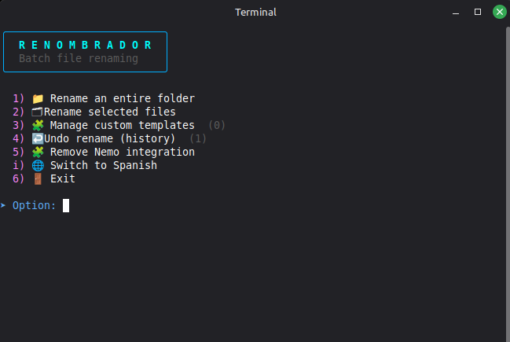
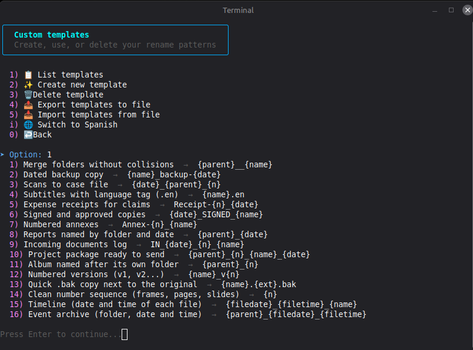
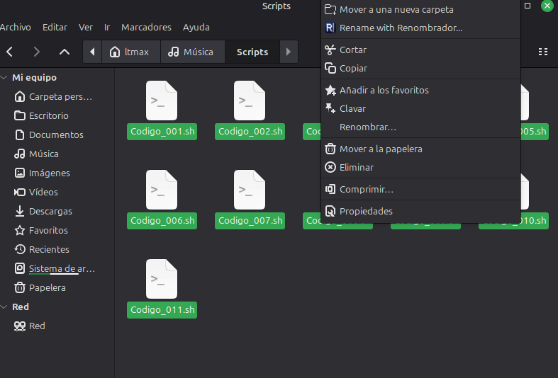

# Renombrador

Batch-renames files and folders from a terminal menu or via right-click in Nemo, with a preview before anything is applied and the option to undo it afterwards.

**Language:** English · [Español](README.es.md)


**Demo:** [watch the video](assets/screenshots/demo-en.mp4) — renaming a folder with a ready-made template: preview, apply and undo.

> **Update 1.1.0**
>
> - **[Spanish and English](#language-and-roadmap).** Menus, help and messages in both languages; switch with `i` (saved), `--lang` or `RENOMBRADOR_LANG`. README in both too.
> - **[Nemo](#installation).** The right-click action can be turned on or off without uninstalling it (`--activar-nemo`, `--desactivar-nemo` or menu option 5), and the icon is now embedded in the script.
> - **[Templates](#ready-made-templates).** New `{filedate}` and `{filetime}` placeholders and 16 ready-to-import templates.
> - **[Safer apply and undo](#undo-and-why-it-is-safe).** Undo only reverts items unchanged since the batch, copies are published atomically, `Ctrl+C` no longer leaves a batch half-done, and settings, templates and history are written atomically.
> - **Also.** Faster EXIF dates on large folders, long names keep their extension, invalid `--inicio`/`--digitos` values are rejected, Bash 4.1+ and `flock` are required, and a regression test suite with ShellCheck runs in CI.
>
> **Upgrading from 1.0.0:** batches saved by 1.0.0 stay in the history but can no longer be undone. Saved templates carry over. If you use the Nemo integration, run `./renombrador.sh --instalar-nemo` again to update the installed copy.

---

It is a single Bash script. The runtime requires Bash 4.1+ and standard GNU/Linux file utilities (including `flock`); `zenity` or `kdialog` is additionally needed only for graphical selectors. It is designed for everyday use: rename 40 photos, 200 invoices, or a downloads folder full of inconsistent names without doing it one file at a time or risking two files ending up with the same name.

**Contents:** [Compatibility](#compatibility) · [Installation](#installation) · [Quick guide](#quick-guide-renaming-a-folder-of-photos) · [Available methods](#available-renaming-methods) · [Undo](#undo-and-why-it-is-safe) · [Command line](#command-line-mode) · [Scriptya](#installing-and-launching-renombrador-with-scriptya) · [Language and roadmap](#language-and-roadmap) · [Tests](#tests) · [Contributing](#contributing)






## Compatibility

Developed and tested on **Linux Mint 22.3 Cinnamon**. The renaming engine itself does not depend on Cinnamon: it requires Bash 4.1 or newer (for `{fd}` redirections) plus GNU/Linux file utilities (including GNU `mv`, `find`, `stat`, `realpath`, `tar`, `sed` and `mktemp`, and `flock` from util-linux). `zenity` or `kdialog` is only needed for graphical selectors. Some well-known examples:

- **Ubuntu/Debian-based:** Ubuntu, Debian, Linux Mint, Pop!_OS, elementary OS, Zorin OS, MX Linux...
- **Fedora-based:** Fedora, Nobara...
- **Arch-based:** Arch Linux, Manjaro, EndeavourOS...
- **openSUSE:** Leap and Tumbleweed

If `zenity` is not installed, the script detects which of these package managers the system uses (`apt`, `dnf`, `pacman` or `zypper`) and offers to install it automatically.

The right-click integration is specific to the **Nemo** file manager (the one used by Cinnamon), present in Linux Mint and in any distro using the Cinnamon desktop. With other desktops (GNOME, KDE Plasma, Xfce, MATE...), the script works exactly the same from the terminal; there is simply no context-menu entry in the file manager.

It also adapts to more limited terminals: in a virtual console without a graphical environment or an SSH session without a UTF-8 locale, menu emoji and symbols automatically fall back to plain text instead of displaying broken characters.

## Installation

```bash
git clone https://github.com/filonux/Renombrador.git
cd Renombrador/script
chmod +x renombrador.sh
./renombrador.sh
```

This opens the main menu directly, without installing anything on the system. For now this is the only installation route — there is no `.deb` package yet (see the mini roadmap below). To also add the Nemo right-click action:

```bash
./renombrador.sh --instalar-nemo
```

This copies the script to `~/.local/share/renombrador/` and adds the **«Rename with Renombrador...»** action to Nemo's context menu. The icon is embedded in the script itself (a 64×64 PNG), so nothing else from the repository is needed: it is installed in your user icon theme (`~/.local/share/icons/hicolor/64x64/apps/renombrador.png`) and the action refers to it by name, which every Nemo version accepts. The action is written in the program's current language (which is saved) and follows its language changes. To remove it: `./renombrador.sh --desinstalar-nemo`. This deletes the Nemo action and that icon; the copy of the script in `~/.local/share/renombrador/`, and your templates and history in `~/.config/renombrador/`, stay in place, so delete those folders by hand if you want no trace left. The main menu can do it too: option 5 switches its label between «Integrate with Nemo (right-click)» and «Remove Nemo integration» according to the current state. Once installed, it opens a submenu to temporarily activate/deactivate the entry without uninstalling it, or to remove it (asking for confirmation) — the same toggle is available from the terminal with `--activar-nemo`/`--desactivar-nemo`.

Optional dependency: `exiftool` (package `libimage-exiftool-perl`) or ImageMagick's `identify`, to read a photo's actual capture date. Without either of them, options that depend on that date automatically fall back to the file modification date.

## Quick guide: renaming a folder of photos

A complete example, from start to finish. Suppose there is a folder `~/Imágenes/Vacaciones` full of photos (about 300) named `IMG_2031.jpg`, `IMG_2032.jpg`... and you want them to become `Vacaciones_001.jpg`, `Vacaciones_002.jpg`..., numbered in the actual order in which they were taken.

1. Open a terminal and run the script:

   ```bash
   ./renombrador.sh
   ```

   The main menu appears.

2. Choose `1` (**Rename an entire folder**). The folder selector opens: navigate to `Vacaciones` and accept.

3. The script asks a few yes/no questions from the keyboard (subfolders, hidden files, extension filter...). For this case, simply press **Enter** on all of them and keep the default values.

4. The methods menu appears. Choose `1` (**Sequential numbering**).

5. It asks:
   - **Base text:** enter `Vacaciones`
   - **Order:** choose `3` (actual EXIF photo date), so that `001` is the first photo actually taken and not the first one in alphabetical order
   - **Starting number** and **padding digits:** press Enter for both. It starts at 1 and the padding follows the total number of files: 100 to 999 photos give `001`, 10 to 99 give `01`, and fewer than 10 give `1`

6. A preview appears: `IMG_2031.jpg → Vacaciones_001.jpg`, and so on for every file. To add another transformation on top (for example, convert everything to lowercase), choose another method from the menu; when it looks right, enter `a` (**Apply all changes**).

7. It asks whether to **move** (rename the files for real) or **copy** (leave the originals untouched and create copies with the new names). For a first test, copying is the safest option.

8. Confirm with `y` and done — the photos now have their new names. `s` is also accepted for compatibility with Spanish input.

It looks long written out step by step, but half of those steps are just pressing Enter to accept the defaults: in practice, it is a couple of minutes of keyboard work to tidy up the whole folder instead of renaming the photos one by one by hand.

If something went wrong, return to the main menu, choose option `4` (**Undo rename (history)**), and press Enter to select the most recent batch (`0` cancels). There is no second confirmation: picking a batch undoes it right away. Items that have changed since the batch was applied are left untouched and stay in the history, so you can retry later.

For day-to-day use without touching the terminal: install the Nemo integration once (`./renombrador.sh --instalar-nemo`) and then, from the file manager, select the files and right-click → **«Rename with Renombrador...»**. A terminal opens with those files already loaded, directly at step 4 above.

## Available renaming methods

From the methods menu you can apply one or more of these, in any order and chained together, with a cumulative preview at all times and the option to undo the last step if something does not look right, before confirming anything:

| Method | What it does |
| --- | --- |
| Sequential numbering | Fixed text + number, or the original name + number. Starts at 1, and the default padding depends on the total number of files: 9 give `Vacaciones_1`, 10 give `Vacaciones_01` and 100 give `Vacaciones_001`. Can be sorted by current order, modification date, actual EXIF date or size. |
| Add prefix | Prepends text to each name. |
| Add suffix | Adds text immediately before the extension. |
| Find and replace | Literal text or regular expression (ERE), with capture groups `\1`, `\2`... in the replacement. |
| Change case | lowercase, UPPERCASE, Title Case, or Sentence case. The first two also change the extension (`Foto.jpg` → `FOTO.JPG`); the other two leave it as it is. |
| Insert date | Current date, modification date or actual EXIF date, at the beginning or end of the name. |
| Clean name | Replaces spaces with underscores or hyphens, or removes them, and removes `< > : " \ \| ? *` from the name (the extension is left untouched). |
| Automatic template by type | Replaces the whole name with the type and a counter of its own for each type, always 3 digits (`Foto_001.jpg`, `Foto_002.jpg`, `Video_001.mp4`...). By extension, the types are `Foto`, `Video`, `Audio`, `Documento`, `Comprimido`, `Codigo` and `Archivo` (everything else). The labels are always these Spanish words, whichever language is selected, so switching language never changes the names. |
| Custom template | Applies a saved template. Templates can be created, listed, deleted, exported and imported from option 3 of the main menu. |
| One-off pattern | Same as a template, but without saving it for later. |

Templates and one-off patterns use these placeholders:

| Placeholder | Replaced with |
| --- | --- |
| `{name}` | Original name, without the extension |
| `{ext}` | Original extension, without the dot |
| `{n}` | Sequence number (asks where to start and how many padding digits to use; by default, from 1 and without padding) |
| `{date}` | Today's date, in `YYYY-MM-DD` format |
| `{parent}` | Name of the folder containing the file |
| `{filedate}` | Date of the file itself, in `YYYY-MM-DD` format: the EXIF capture date for photos, the modification date for everything else |
| `{filetime}` | Time of the file itself, in `HH-MM-SS` format, from the same source as `{filedate}` |

If the template does not include `{ext}`, the original extension is added automatically at the end. Example: `{date}_{name}_{n}` on `factura.pdf` → `2026-08-04_factura_1.pdf`.

### Ready-made templates

[`assets/templates/`](assets/templates/) ships 16 templates ready to import: `example-templates.en.conf` (English names) and `plantillas-ejemplo.es.conf` (Spanish names) hold the same 16 patterns. In the main menu choose `3` (**Manage custom templates**), then `5` (**Import templates from file**) and pick the file. Names you already have are skipped, so importing twice is harmless.

With no saved templates, **Use saved custom template** offers to load templates from a file and goes straight to the list; the picker opens in `assets/templates/` when it exists next to the script. Only text files up to 1 MiB are accepted; BOM and CRLF are cleaned.

| # | Template | Pattern |
| --- | --- | --- |
| 1 | Merge folders without collisions | `{parent}__{name}` |
| 2 | Dated backup copy | `{name}_backup-{date}` |
| 3 | Scans to case file | `{date}_{parent}_{n}` |
| 4 | Subtitles with language tag (.en) | `{name}.en` |
| 5 | Expense receipts for claims | `Receipt-{n}_{date}` |
| 6 | Signed and approved copies | `{date}_SIGNED_{name}` |
| 7 | Numbered annexes | `Annex-{n}_{name}` |
| 8 | Reports named by folder and date | `{parent}_{date}` |
| 9 | Incoming documents log | `IN_{date}_{n}_{name}` |
| 10 | Project package ready to send | `{parent}_{n}_{name}_{date}` |
| 11 | Album named after its own folder | `{parent}_{n}` |
| 12 | Numbered versions (v1, v2...) | `{name}_v{n}` |
| 13 | Quick .bak copy next to the original | `{name}.{ext}.bak` |
| 14 | Clean number sequence (frames, pages, slides) | `{n}` |
| 15 | Timeline (date and time of each file) | `{filedate}_{filetime}_{name}` |
| 16 | Event archive (folder, date and time) | `{parent}_{filedate}_{filetime}` |

The last two build the name from each file's own date and time. The built-in **Insert date** method only adds the date, so these are the way to get the time of day into a name. The timestamp leads, so sorting by name is sorting by time, even when the files come from different phones and cameras. **Event archive** drops the original name; **Timeline** keeps it. Two files stamped in the same second never overwrite each other: the second one gets `(1)`.

## Undo and why it is safe

Each applied batch is stored in a history: option `4` in the main menu lets you review the last 20 batches and undo whichever one you want, not just the most recent; choosing a batch undoes it immediately. History written by older versions without state verification is kept, but it is not automatically undone.

Undoing a batch applied in copy mode does not «restore» anything (the originals were never touched): it deletes only copies whose stored state still matches the batch. A batch applied in move mode returns each unchanged item to its original name; changed items are left untouched.

Under the hood, in **move** mode both applying and undoing changes happen in two phases: everything is first moved to unique temporary names and only then to the final names. This means a batch where file A becomes B and B becomes A at the same time is handled correctly, instead of one overwriting the other — something a simple `mv` loop cannot handle safely. **Copy** mode has no such phases: each item is copied into a hidden staging folder next to it and published under its final name in one step, so an interrupted copy never leaves a half-written file, and undoing a copy batch removes the copies one by one. Configuration, template and history files are written to a temporary file in the same directory, synced before publication, and then atomically replaced with `mv -T` so readers never observe a partially written file. New history entries also store a fingerprint of each item (its full contents, or size and modification date for files over 8 MiB) so undo can detect later changes instead of touching current data.

If you interrupt with `Ctrl+C` (or SIGTERM or SIGHUP arrives, for example when the terminal is closed) while a batch is being applied or undone, the script does not stop halfway: in move mode it finishes both phases and updates the history before exiting; in copy mode it stops once the current item is done. Copies already made stay in the history, and when undoing, whatever was not reached is still in it so you can retry. It exits with a notice and with code 130 (`Ctrl+C`), 143 (SIGTERM) or 129 (SIGHUP). Outside that stretch, `Ctrl+C` ends the script immediately: at a menu or a question nothing has been touched yet.

If the process dies without a chance to clean up (a power cut, `kill -9`), hidden `.renombrador_*` items may be left in the folders. When starting to apply or undo a batch (already confirmed; never with `--dry-run`), the script checks the folders that contain items of the batch. It deletes the copy staging folders `.renombrador_stage.*`, because the original still exists, but does not touch `.renombrador_tmp_*`, `.renombrador_undo_tmp_*` or `.renombrador_backup_*`, which may be the only copy of a file: it only reports how many there are and in which folder, so they can be reviewed and renamed by hand. Items belonging to another Renombrador run that is still alive are ignored.

When applying, every new name is sanitized: `/` becomes `-`; spaces and tabs are trimmed only at the ends of the whole name (`x .txt` keeps the space before the extension); an empty name, `.` or `..` becomes `sin_nombre_N`, with a random number; and a name over 255 bytes is shortened to fit, keeping its extension when that is up to 16 characters long. Invalid characters are not removed when applying: the Clean name method does that. Only if `mv` or `cp` fails (typical on FAT and exFAT) is it retried once with `\ : * ? " < > |` replaced by `_`.

Nothing is ever overwritten without saying so explicitly: by default, if a name already exists, an automatic suffix `(1)`, `(2)`... is added, although you can also choose to overwrite the existing file or skip that item instead. Batches with more than 200 items also show a progress bar while changes are applied.

## Command line mode

Everything above can also be requested without going through any menu, to automate it with keyboard shortcuts, your own scripts or scheduled tasks. It is optional — normal day-to-day use does not require it. Each interactive method has an equivalent set of flags:

| `--metodo` | Main parameters |
| --- | --- |
| `numeracion` | `--base TEXT` or `--mantener-nombre`, `--inicio N`, `--digitos N`, `--orden actual\|fecha\|exif\|tamano` |
| `prefijo` | `--prefijo TEXT` |
| `sufijo` | `--sufijo TEXT` |
| `buscar-reemplazar` | `--buscar TEXT --reemplazar TEXT`, `--regex` |
| `mayus-minus` | `--caso minusculas\|mayusculas\|capitalizar\|frase` |
| `fecha` | `--fecha-origen actual\|modificacion\|exif`, `--fecha-pos inicio\|final` |
| `limpiar` | `--espacios guion_bajo\|guion\|eliminar` |
| `tipo` | (no extra parameters) |
| `plantilla` | `--plantilla NAME`, `--inicio N`, `--digitos N` |
| `patron` | `--patron '{date}_{name}_{n}'`, `--inicio N`, `--digitos N` |

Plus the general flags: source with `--carpeta PATH` or `--archivo PATH` (repeatable); selection with `--recursivo`, `--ocultos`, `--incluir-carpetas`, `--seguir-enlaces`, `--filtro ext1,ext2`; and application with `--modo mover\|copiar`, `--conflicto sufijo\|sobrescribir\|omitir`, `--dry-run` and `--sin-confirmar`.

A broken symbolic link is an item like any other: it is included inside a folder, with `--archivo` and from Nemo, and what gets renamed or copied is the link itself. A link that points to `/` is refused.

`--inicio N` (default 1) and `--digitos N` (0 to 18) set the number to count from and how many digits to pad to. In `numeracion`, without `--digitos` the padding follows the total number of files; in `plantilla` and `patron` there is no padding by default, and both flags only take effect if the template contains `{n}`. With any other method they are accepted and ignored, but an invalid value (non-numeric or out of range) always exits with code 1.

```bash
./renombrador.sh --carpeta ~/Fotos --recursivo --metodo fecha --fecha-origen exif --dry-run
./renombrador.sh --carpeta ~/Descargas --metodo prefijo --prefijo "2026_" --sin-confirmar
```

`--dry-run` shows the result without touching anything; `--sin-confirmar` applies the changes directly. The full list is always available with `./renombrador.sh --help` (`--ayuda` and `-h` are aliases), and the current version with `./renombrador.sh --version` (`-v` is an alias).

Exit codes, for scripts and scheduled tasks:

| Code | When |
| --- | --- |
| `0` | The batch was applied, it was only a preview (`--dry-run`), there was nothing to change, or everything was skipped (`--conflicto omitir`). Also when cancelling at the confirmation, with `--help`, `--version`, on leaving the menu and with `--desinstalar-nemo` (even if the action was not installed). |
| `1` | Unknown flag or missing value; invalid value (including `--inicio` and `--digitos`); source that does not exist, is unsafe or has no items; folder without write permission (nothing is changed); at least one item of the batch failed (the rest are applied); `--activar-nemo` or `--desactivar-nemo` without the action installed; failure to install or remove the Nemo action; and, in the menu, having neither `zenity` nor `kdialog` and declining to install one. |
| `2` | `--lang` with an invalid language or no value. |
| `129`, `130`, `143` | Interrupted by SIGHUP (for example, when the terminal is closed), Ctrl+C (SIGINT) or SIGTERM. See [Undo](#undo-and-why-it-is-safe). |

## Installing and launching Renombrador with Scriptya

[Scriptya](https://github.com/filonux/Scriptya) is a script launcher: it organizes your scripts in a searchable menu and can turn any of them into a desktop app with its own icon, without writing a `.desktop` file by hand. It recognizes a few optional metadata lines in the first lines of the script, right after the shebang. Just add something like this at the beginning of `renombrador.sh` so it appears in Scriptya's menu with its own name and description instead of the file name:

```bash
#!/usr/bin/env bash
# MENU: Renombrador
# DESCRIPTION: Batch-renames files and folders, with templates and undo
# TERMINAL: true
```

If Scriptya is already installed:

1. Copy or clone `Renombrador/` (or only `script/renombrador.sh`) into the scripts folder configured in Scriptya.
2. Open Scriptya (`scriptya`). Renombrador appears in the menu and launches in a new terminal when selected.
3. For a custom icon and a separate entry in the Cinnamon menu or on the desktop, use **«Install Scripts»** (from Scriptya's own menu, or with `scriptya --icons`), choose `renombrador.sh` and point it to `assets/icons/renombrador.png` from this repository when it asks for an icon.

If Scriptya is not installed yet, its installer (`./scriptya.sh --install`) lets you choose or create the scripts folder the first time. It is completely optional: Renombrador works the same with or without Scriptya.

## Language and roadmap

Renombrador now supports **Spanish and English**. On startup it uses the language you saved and, if there is none, checks the system message locale in the standard order: `LC_ALL`, then `LC_MESSAGES`, then `LANG`. Spanish locales start in Spanish; every other locale defaults to English. You can switch language at any time with the `i` key from the main, methods and templates menus: the choice is **saved** in `~/.config/renombrador/idioma.conf` and kept the next time the program opens (including when opened from Nemo). If the Nemo action is installed, it is rewritten in the new language and keeps its active or inactive state.

The CLI also supports `--lang es` and `--lang en`, which apply to that run only and are not saved. The option can be placed anywhere in the command. `RENOMBRADOR_LANG=es|en` takes priority over the saved language and over automatic detection; an invalid value is ignored. Order of precedence: `--lang`, `RENOMBRADOR_LANG`, saved language, then system locale.

The interface and messages are translated, while internal file-type labels and command-line identifiers remain stable so changing language does not change generated names or break existing automation.

**Mini roadmap**, subject to real interest:

- [ ] `.deb` package for installation with `apt`/`dpkg`, without going through `git clone`

## Tests

The project includes a full regression suite for localization, the renaming engine, history safety and atomic persistence:

```bash
./tests/run.sh
```

It checks Bash syntax, translation-key coverage and placeholder parity, locale precedence, language overrides, the one-letter toggle, the renaming methods, CLI behavior, recursive filters, copy mode, dry-run, collision handling, templates, validation, version stability, and history/undo behavior. Besides Bash it needs `python3` (standard library only) to validate the icon, the READMEs and the translations; the script itself does not use it. Static analysis is a separate gate:

```bash
./tests/lint.sh
```

`tests/lint.sh` requires ShellCheck 0.11.0 and fails explicitly when the linter is unavailable or has a different version. The GitHub Actions quality workflow installs that exact version, verifies its SHA-256 checksum, and runs the static-analysis and functional-test gates.

## Contributing

Issues and pull requests are welcome — there are templates in `.github/` for reporting bugs or proposing improvements. The full guide is in [CONTRIBUTING.md](.github/CONTRIBUTING.md), and the project's code of conduct is in [CODE_OF_CONDUCT.md](.github/CODE_OF_CONDUCT.md). To report a security problem, please do so privately using [SECURITY.md](.github/SECURITY.md) rather than opening a public issue.

## License

GPLv3. See the [LICENSE.txt](LICENSE.txt) file.

---

Made by **[Filonux](https://github.com/filonux)**.
